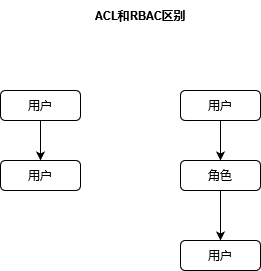

# 权限模块
## 1.1 权限概念
认证：验证用户名密码是否正确的过程  
授权：对用户访问的资源进行控制（动态显示菜单、url级别的权限控制）

## 1.2 为什么要实现权限系统
首先系统需要登录才能访问，其次不同登录用户要有不同的权利，而且要有不同的菜单。

## 1.3权限控制基本原理
### 1.3.1 ACL（Access Control Lists）
ACL是最早也是最基本的一种访问控制机制，原理：每一项资源，都分配有一个列表，这个列表记录的是哪些用户可以对这项资源执行CRUD中的哪些操作。
当系统试图访问这项资源时，会首先检查这个列表中是否有关于当前用户的访问权限，从而确定当前用户可否执行相应的操作。
ACL是一种面向资源的访问控制模型，它的机制是围绕“资源”展开的。

### 1.3.2 基于角色的访问控制RBAC（Role-Based Access Control）
RBAC是把用户角色进行归类，通过用户的角色来确定用户能否针对某项资源进行某项操作。
RBAC相对于ACL最大的优势是它简化了用户与权限的管理，通过对用户进行分类，使得角色与权限关联起来，而用户与权限变成了间接关联。
RBAC模型使得访问控制，特别是对用户的授权管理变得非常简单和便于维护，应用广泛。  

权限系统经典五张表（用户表、角色表、权限表、用户-角色中间表、角色-权限中间表）

